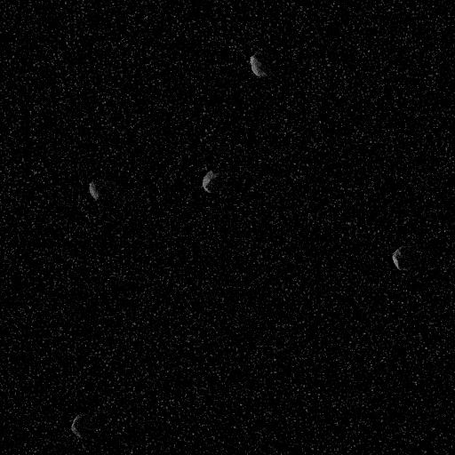
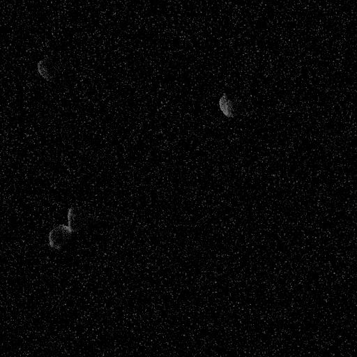
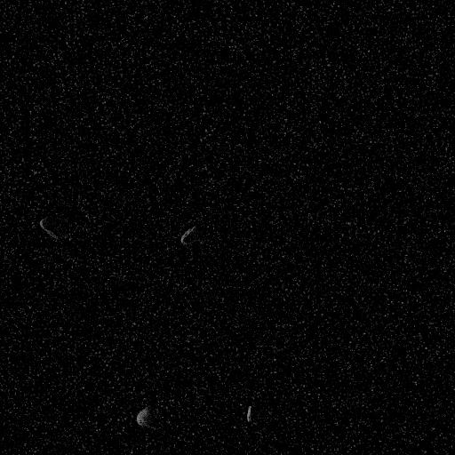
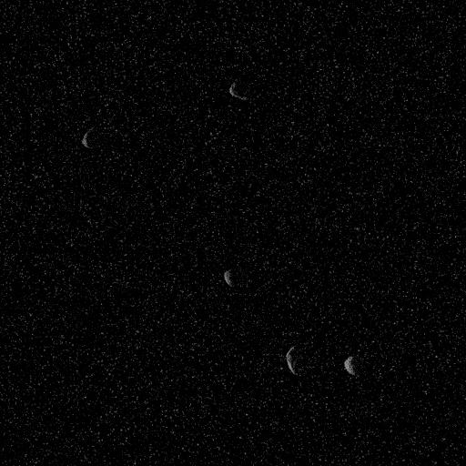

# Space Debris Detection

An object detection model built with **Faster R-CNN** to identify and localize space debris in satellite imagery. Trained on 20,000+ images using a ResNet-50 + FPN backbone, achieving **90.9% mAP@50** and **89.4% mAP@75**.

---

## Dataset

| Property | Value |
|---|---|
| **Training images** | 20,000 |
| **Validation images** | 2,000 |
| **Image size** | 512 × 512 px |
| **Format** | RGB `.jpg` |
| **Source** | [Debris Data](https://www.kaggle.com/datasets/sadianawar/debris-detection-dataset) |

### Sample Training Images

  
  
  
  

---

## Model Architecture

| Component | Details |
|---|---|
| **Model** | Faster R-CNN |
| **Backbone** | ResNet-50 + FPN (Feature Pyramid Network) |
| **Input size** | 512 × 512 px |
| **Classes** | 2 (background + debris) |

### Hardware

| | |
|---|---|
| **GPU** | NVIDIA A100-SXM4-40GB |
| **Precision** | BF16 (PyTorch AMP) |
| **Avg. epoch time** | ~487s (~8 min) |

## Results

### Training Progression — Epoch 1 vs. Epoch 31

The images below show model predictions on validation samples at the start of training versus the end, demonstrating how the model learned to accurately detect and localize debris over time.

  <strong>Epoch 1 (Initial)</strong> 
  

  <strong>Epoch 31 (Best)</strong> 
  

### Summary — First vs. Best

| Metric | Epoch 1 | Epoch 31 | Improvement |
|---|---|---|---|
| **Loss** | 0.5790 | 0.2045 | ↓ 64.7% |
| **mAP@50** | 0.904 | 0.909 | ↑ 0.6% |
| **mAP@75** | 0.399 | 0.894 | ↑ 124.1% |
| **Confidence** | 0.565 | 0.997 | ↑ 76.5% |

### Full Training Log (34 Epochs)

Click to expand full training metrics

| Epoch | Loss | mAP@50 | mAP@75 | Confidence | LR |
|---|---|---|---|---|---|
| 1 | 0.5790 | 0.904 | 0.399 | 0.565 | 0.003400 |
| 2 | 0.3452 | 0.909 | 0.758 | 0.983 | 0.006700 |
| 3 | 0.2843 | 0.909 | 0.779 | 0.989 | 0.010000 |
| 4 | 0.2619 | 0.909 | 0.869 | 0.992 | 0.010000 |
| 5 | 0.2460 | 0.909 | 0.877 | 0.992 | 0.010000 |
| 6 | 0.2416 | 0.909 | 0.878 | 0.995 | 0.010000 |
| 7 | 0.2331 | 0.909 | 0.882 | 0.992 | 0.010000 |
| 8 | 0.2303 | 0.909 | 0.884 | 0.991 | 0.010000 |
| 9 | 0.2295 | 0.909 | 0.884 | 0.994 | 0.010000 |
| 10 | 0.2295 | 0.909 | 0.881 | 0.995 | 0.010000 |
| 11 | 0.2208 | 0.909 | 0.886 | 0.987 | 0.010000 |
| 12 | 0.2221 | 0.909 | 0.890 | 0.992 | 0.010000 |
| 13 | 0.2206 | 0.909 | 0.889 | 0.992 | 0.010000 |
| 14 | 0.2204 | 0.909 | 0.888 | 0.996 | 0.010000 |
| 15 | 0.2210 | 0.909 | 0.883 | 0.994 | 0.010000 |
| 16 | 0.2155 | 0.909 | 0.891 | 0.994 | 0.010000 |
| 17 | 0.2156 | 0.909 | 0.889 | 0.996 | 0.010000 |
| 18 | 0.2123 | 0.909 | 0.893 | 0.996 | 0.001000 |
| 19 | 0.2062 | 0.909 | 0.891 | 0.997 | 0.001000 |
| 20 | 0.2045 | 0.909 | 0.893 | 0.997 | 0.001000 |
| 21 | 0.2064 | 0.909 | 0.892 | 0.997 | 0.001000 |
| 22 | 0.2086 | 0.909 | 0.892 | 0.997 | 0.001000 |
| 23 | 0.2046 | 0.909 | 0.892 | 0.996 | 0.001000 |
| 24 | 0.2068 | 0.909 | 0.892 | 0.997 | 0.001000 |
| 25 | 0.2080 | 0.909 | 0.893 | 0.997 | 0.001000 |
| 26 | 0.2065 | 0.909 | 0.892 | 0.997 | 0.001000 |
| 27 | 0.2058 | 0.909 | 0.893 | 0.996 | 0.001000 |
| 28 | 0.2087 | 0.909 | 0.894 | 0.996 | 0.001000 |
| 29 | 0.2102 | 0.909 | 0.893 | 0.996 | 0.001000 |
| 30 | 0.2065 | 0.909 | 0.893 | 0.997 | 0.001000 |
| 31 | 0.2089 | 0.909 | 0.894 | 0.997 | 0.001000 |
| 32 | 0.2088 | 0.909 | 0.893 | 0.997 | 0.001000 |
| 33 | 0.2085 | 0.909 | 0.892 | 0.997 | 0.000100 |
| 34 | 0.2064 | 0.909 | 0.893 | 0.997 | 0.000100 |

### Key Observations

- **Loss** dropped from **0.579 -> 0.230** in the first 8 epochs, and continued to **0.205** by epoch 20
- **mAP@50** converged quickly to **0.909** by epoch 2 and held steady throughout all 34 epochs
- **mAP@75** showed the largest improvement: **0.399 -> 0.894** (+124.1%), indicating the model learned precise bounding box localization
- **Confidence** jumped from **0.565 -> 0.983** after just 1 epoch, peaking at **0.997**
---
